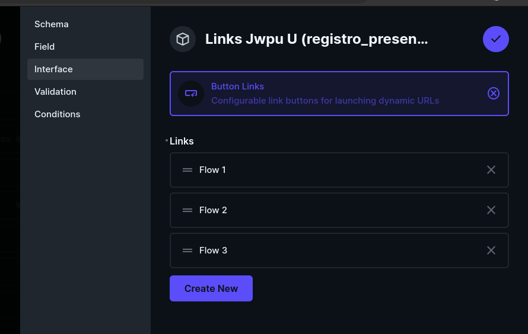
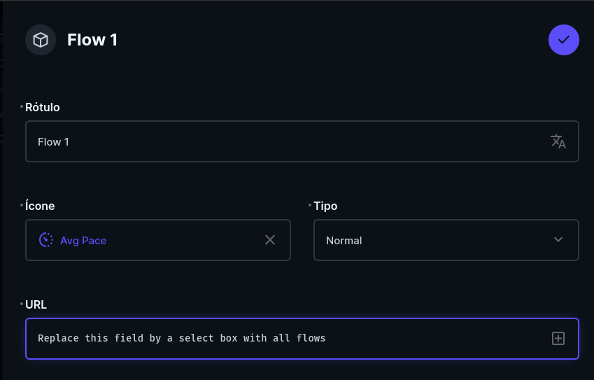
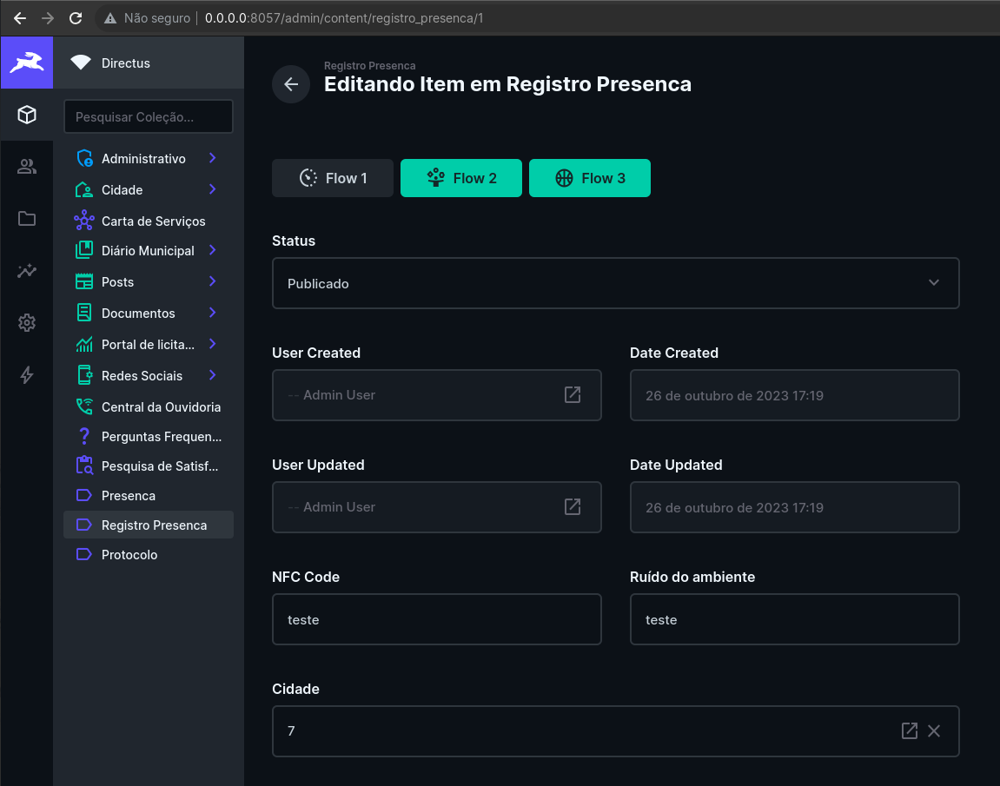

# Button to Flow

http://localhost:8057/admin/login

Just a button to trigger a flow action

```console
pnpm i
pnpm run start
```

## Replace button links interface



## Replace URL by a select field



## Call the flow on click


